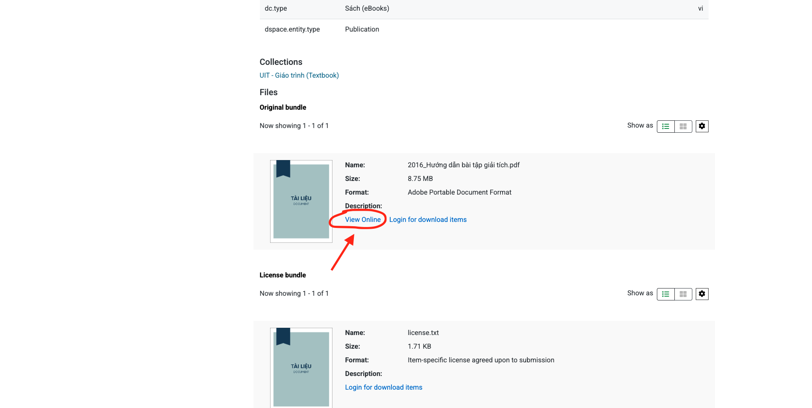
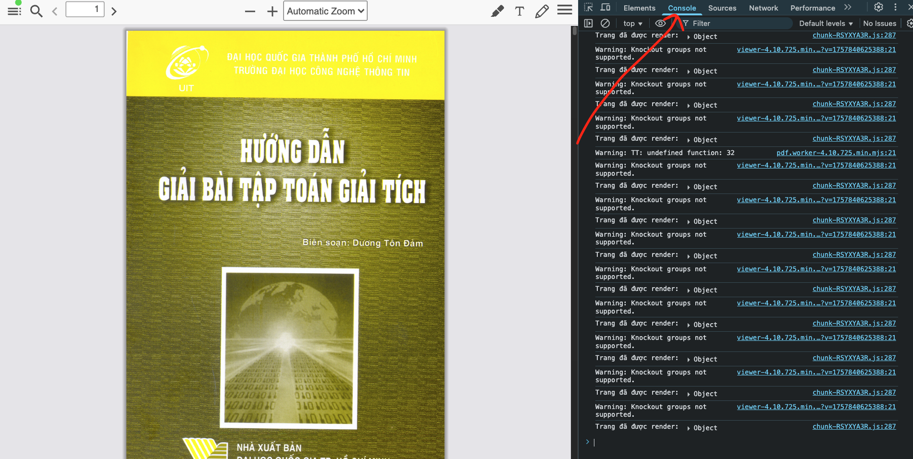
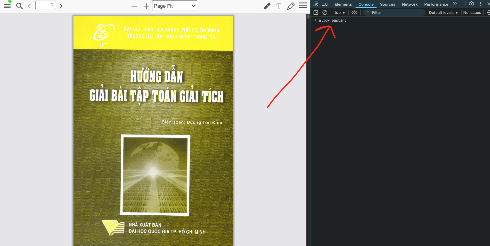
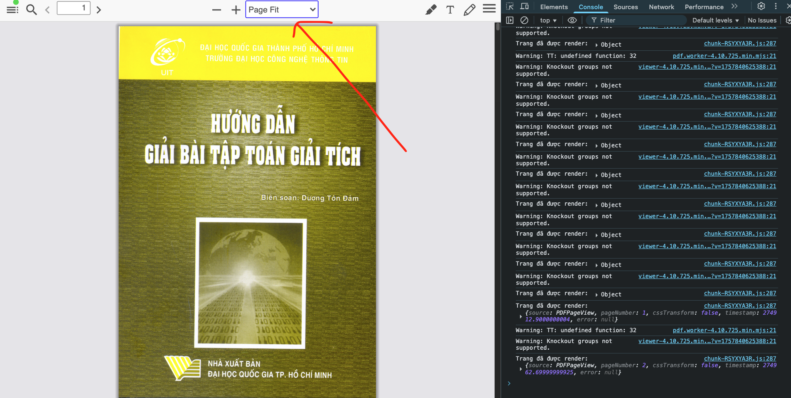
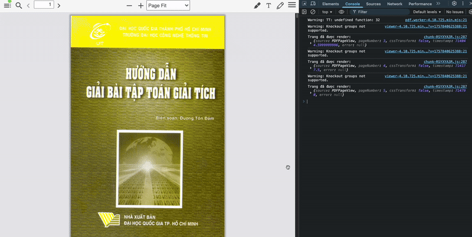

# VNULib Book Capture Script

This script allows you to **capture HTML elements representing book pages** in [VNULib](https://ir.vnulib.edu.vn/) and save them as a single PDF file using [html2canvas](https://github.com/niklasvh/html2canvas) and [jsPDF](https://github.com/parallax/jsPDF).

---

## 🚀 Features

- Captures each page of [VNULib](https://ir.vnulib.edu.vn/) book viewer (HTML element `.page[data-page-number]`).
- Automatically scrolls pages into view before capturing.
- Converts each page into a compressed JPEG image.
- Exports all captured pages into a single PDF.

---

## 📦 Dependencies

The script loads required libraries dynamically from CDN:

- [html2canvas 1.4.1](https://cdnjs.com/libraries/html2canvas)
- [jsPDF 2.5.1](https://cdnjs.com/libraries/jspdf)

No manual installation is required.

---

## 💻 Usage

1. Choose a book and Click `View online` in [VNULib](https://ir.vnulib.edu.vn/).



2. Open **Developer Tools → Console** in the book viewer.



3. Type `allow pasting` in **Console**.



4. Choose Zoom option to `Page fit` for resolution optimization.



4. Paste the script into the console and run it.

_Note: It may take 10-15 minutes to capture a 150-200 pages book._

```js
const s = document.createElement("script");
s.src =
  "https://cdnjs.cloudflare.com/ajax/libs/html2canvas/1.4.1/html2canvas.min.js";
s.onload = () => {
  console.log("html2canvas loaded ✅");

  const s2 = document.createElement("script");
  s2.src =
    "https://cdnjs.cloudflare.com/ajax/libs/jspdf/2.5.1/jspdf.umd.min.js";
  s2.onload = () => {
    console.log("✅ jsPDF loaded");
    const { jsPDF } = window.jspdf;
    const pdf = new jsPDF("p", "pt", "a4");

    let pages = document.querySelectorAll(".page[data-page-number]");

    (async () => {
      for (let i = 0; i < pages.length; i++) {
        pages[i].scrollIntoView({ behavior: "instant", block: "center" });
        await new Promise((res) => setTimeout(res, 300));

        let canvas = await html2canvas(pages[i], { scale: 1, useCORS: true });
        let dataUrl = canvas.toDataURL("image/jpeg", 0.7);

        if (i > 0) pdf.addPage();
        pdf.addImage(dataUrl, "JPEG", 0, 0, 595, 842);
        console.log(`✅ Captured page ${i + 1}`);
      }
      pdf.save("book.pdf");
    })();
  };
  document.body.appendChild(s2);
};
document.body.appendChild(s);
```

5. The script will:
   - Loop through all pages.
   - Scroll each into view.
   - Capture it with html2canvas.
   - Add it to a PDF.
   - Download `book.pdf` once finished.



---

## 📜 Usage Policy

This script is provided strictly for personal use only.

✅ You may use it for studying, research, or keeping personal offline copies of materials you legally have access to.

❌ Not for commercial purposes, redistribution, or copyright infringement.

Please respect the rights of authors, publishers, and VNU Library when using this tool.

## 👨🏼‍💻 Author & Credits

This script was written by James Cao

📌 Connect with me:

- 🌐 [GitHub](https://github.com/jameskaois)
- 🐦 [X (Twitter)](https://x.com/jameskaois)
